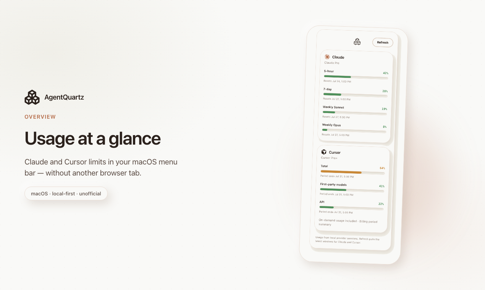
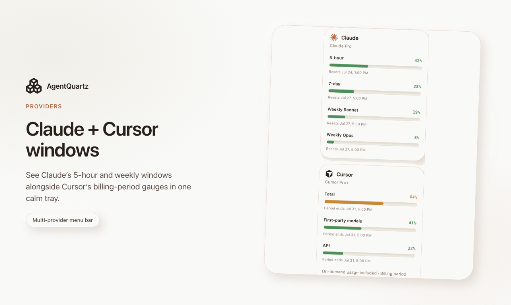

  

<h1 align="center">AgentQuartz</h1>

  <strong>Claude &amp; Cursor usage in your macOS menu bar</strong>

  A lightweight, local-first tray companion — glance at limits without another browser tab. 
  Settings stay on your machine. No AgentQuartz cloud account.

  <a href="https://agentquartz.vercel.app"><strong>Website</strong></a>
  ·
  <a href="https://github.com/marco-calderon/agent-quartz-releases/releases/latest"><strong>Download for macOS</strong></a>
  ·
  <a href="https://github.com/marco-calderon/agent-quartz-releases/issues"><strong>Report a problem</strong></a>

  

  

---

## Download

Get the latest **unsigned** macOS `.app` zip from the
[latest GitHub Release](https://github.com/marco-calderon/agent-quartz-releases/releases/latest).

Product site (overview, pricing, Gatekeeper notes):
**[agentquartz.vercel.app](https://agentquartz.vercel.app)**

This repository is the public **download host** and **issue tracker**. It does **not** contain application source code.

---

## First open on macOS (Gatekeeper)

Builds are unsigned, so macOS may block the app on first launch:

1. Download and unzip the release asset.
2. Move `AgentQuartz.app` to Applications (or another location you prefer).
3. Right-click (or Control-click) the app and choose **Open**, then confirm **Open** in the dialog.
4. If needed, allow the app under **System Settings → Privacy & Security**.

---

## Report a problem

Use **[GitHub Issues](https://github.com/marco-calderon/agent-quartz-releases/issues)** on this repository:

- [Bug report](https://github.com/marco-calderon/agent-quartz-releases/issues/new?template=bug_report.yml) — something broken or unexpected
- [Feature request](https://github.com/marco-calderon/agent-quartz-releases/issues/new?template=feature_request.yml) — ideas and improvements

Please **do not** paste API keys, session cookies, or other secrets into issues.

---

*Unofficial companion — not affiliated with Anthropic or Cursor.*
